# PolyASM Payload Builder

**PolyASM Builder** — это специализированный фреймворк (сборочный цех) для генерации высокозащищенных полиморфных shellcode-пейлоадов под Linux. 

Фреймворк компилирует исходный код, написанный на кастомном языке программирования, проводит множественные проходы обфускации на уровне промежуточного представления (IR), генерирует PIE Assembly, собирает его в бинарный файл и автоматически извлекает секцию `.text`, выдавая на выходе чистый raw-shellcode (`payload.bin`), готовый к инжекту.

## 🛠 Архитектура

Проект построен с использованием интерфейсов и композиции (Go-way OOP). Логика разделена на два основных конвейера: **Compiler Pipeline** (генерация и обфускация кода) и **Builder & Extractor** (сборка и извлечение байт).

### Диаграмма классов (Mermaid)

```mermaid
classDiagram
    %% Core Facade
    %% Subsystem 1: Compiler Pipeline
    class Parser {
        <<interface>>
        +ParseProgram(tokens) *ast.Program
        +Errors() []string
    }
    class ParserImpl {
        l      lexer.Lexer
        errors []string
        curToken  lexer.Token
        peekToken lexer.Token
        prefixParseFns map[lexer.TokenType]prefixParseFn
        infixParseFns  map[lexer.TokenType]infixParseFn
        +ParseProgram(tokens) *ast.Program
        +Errors() []string
    }
    
    class Lexer {
        <<interface>>
        +NewToken() Token
    }
    
    class LexerImpl {
        input        string
	    position     int  // текущая позиция (указывает на текущий символ)
	    readPosition int  // следующая позиция (после текущего символа)
	    ch           byte // текущий символ
	    line         int
	    column       int
        +NewToken() Token
    }
    
    class Node {
        <<interface>>
        +TokenLiteral() string
	    +String() string
    }
    class Statement {
        <<interface>>
        -statementNode()
        +TokenLiteral() string
	    +String() string
    }
    class Expression {
        <<interface>>
        -expressionNode()
        +TokenLiteral() string
	    +String() string
    }
    
    class Program {
        +Statements []Statement
        +TokenLiteral() string
        +String()
    }

    class LetStatement {
      Token lexer.Token
      Name  *Identifier
      Value Expression
      -statementNode()
      +TokenLiteral() string
      +String() string
    }

    class ExpressionStatement {
	    Token      lexer.Token
	    Expression Expression
	    -statementNode()
        +TokenLiteral() string
        +String() string
    }
    
    class BlockStatement {
	    Token      lexer.Token
	    Statements []Statement
	    -statementNode()
        +TokenLiteral() string
        +String() string
    }
    
    class IfStatement {
      Token       lexer.Token
      Condition   Expression
      Consequence *BlockStatement
      Alternative *BlockStatement
      -statementNode()
      +TokenLiteral() string
      +String() string
    }
    
    class WhileStatement {
        Token     lexer.Token
        Condition Expression
        Body      *BlockStatement
        -statementNode()
        +TokenLiteral() string
        +String() string
    }

    class ImportStatement {
        Token lexer.Token
        Path  *StringLiteral
        -statementNode()
        +TokenLiteral() string
        +String() string
    }

    class BlockStatement {
        Token      lexer.Token
        Statements []Statement
        -statementNode()
        +TokenLiteral() string
        +String() string
    }

    class IfStatement {
        Token       lexer.Token
        Condition   Expression
        Consequence *BlockStatement
        Alternative *BlockStatement
        -statementNode()
        +TokenLiteral() string
        +String() string
    }


    %% -------------------- Реализации Expression --------------------

    class Identifier {
        Token lexer.Token
        Value string
        -expressionNode()
        +TokenLiteral() string
        +String() string
    }

    class IntegerLiteral {
        Token lexer.Token
        Value int64
        -expressionNode()
        +TokenLiteral() string
        +String() string
    }

    class StringLiteral {
        Token lexer.Token
        Value string
        -expressionNode()
        +TokenLiteral() string
        +String() string
    }

    class InfixExpression {
        Token    lexer.Token
        Left     Expression
        Operator string
        Right    Expression
        -expressionNode()
        +TokenLiteral() string
        +String() string
    }

    class CallExpression {
        Token     lexer.Token
        Function  Expression
        Arguments []Expression
        -expressionNode()
        +TokenLiteral() string
        +String() string
    }

    namespace ir {
        class Value {
            <<interface>>
            +String() string
        }

        class IRContext {
            -vregCounter int
            -labelCounter int
            +NextVReg() VReg
            +NextLabel() Lbl
            +GetVRegCount() int
        }

        class VReg {
            +ID int
            +String() string
        }

        class Imm {
            +Value int64
            +String() string
        }

        class Str {
            +Value string
            +String() string
        }

        class Lbl {
            +Name string
            +String() string
        }

        class Instruction {
            +Op Opcode
            +Dst Value
            +Src1 Value
            +Src2 Value
            +Args []Value
            +String() string
        }

        class Generator {
            +Instructions []Instruction
            -vregCounter int
            -labelCounter int
            -env map[string]VReg
            -ctx *IRContext
            +NewGenerator(ctx *IRContext) *Generator
            -emit(inst Instruction)
            +Generate(program *ast.Program)
            -generateStatement(node ast.Statement)
            -generateExpression(node ast.Expression) VReg
            +Print()
        }

        class MacroExpander {
            -ctx *IRContext
            +NewMacroExpander(ctx *IRContext) *MacroExpander
            +Expand(input []Instruction) []Instruction
            -expandCopy(src Value, dst Value) []Instruction
            -expandWrite(path Value, offset Value, data Value) []Instruction
            -expandUserAdd(user Value, pass Value) []Instruction
            -expandGetFileSize(result Value, path Value) []Instruction
        }

        class RegisterAllocator {
            -asmCode strings.Builder
            +NewRegisterAllocator() *RegisterAllocator
            -emitAsm(format string, args interface)
            -vRegToStack(v VReg) string
            -loadValue(val Value, physReg string)
            +Allocate(insts []Instruction, total int) string
        }
    }

    
    %% Relationships
    Lexer <|.. LexerImpl : implements
    Parser <|.. ParserImpl : implements
    Parser *-- Lexer : owns
    Node <|-- Statement : embeds
    Node <|-- Expression : embeds
    Node <|.. Program : implements
    Node <|.. LetStatement : implements
    Statement <|.. LetStatement : implements
    Node <|.. ExpressionStatement : implements
    Statement <|.. ExpressionStatement : implements
    Node <|.. BlockStatement : implements
    Statement <|.. BlockStatement : implements
    Node <|.. IfStatement : implements
    Statement <|.. IfStatement : implements
    
    %% Реализация интерфейсов для Statement
    Node <|.. WhileStatement : implements
    Statement <|.. WhileStatement : implements

    Node <|.. ImportStatement : implements
    Statement <|.. ImportStatement : implements

    Node <|.. BlockStatement : implements
    Statement <|.. BlockStatement : implements

    Node <|.. IfStatement : implements
    Statement <|.. IfStatement : implements
    
    Node <|.. Identifier : implements
    Expression <|.. Identifier : implements

    Node <|.. IntegerLiteral : implements
    Expression <|.. IntegerLiteral : implements

    Node <|.. StringLiteral : implements
    Expression <|.. StringLiteral : implements

    Node <|.. InfixExpression : implements
    Expression <|.. InfixExpression : implements

    Node <|.. CallExpression : implements
    Expression <|.. CallExpression : implements
    
    Value <|.. VReg : implements
    Value <|.. Imm : implements
    Value <|.. Str : implements
    Value <|.. Lbl : implements

    %% Связи Instruction
    Instruction *-- Value : Dst/Src/Args
    
    %% Связи Generator
    Generator o-- IRContext : uses
    Generator "1" *-- "n" Instruction : contains
    
    %% Связи MacroExpander
    MacroExpander o-- IRContext : uses
    MacroExpander ..> Instruction : expands to

    %% Связи RegisterAllocator
    RegisterAllocator ..> Instruction : consumes
    RegisterAllocator ..> VReg : translates
    Generator o-- Program : uses
    Generator o-- Statement : uses
    Generator o-- Expression : uses
    %%Namespaces
    namespace ast {
        class Node 
        class Statement 
        class Expression
        class Program
        class LetStatement
        class ExpressionStatement
        class BlockStatement
        class IfStatement
        class WhileStatement
        class ImportStatement
        class Identifier
        class IntegerLiteral
        class StringLiteral
        class InfixExpression
        class CallExpression
    }

    
    
```



## 🧩 Описание компонентов

### 1. Compiler Pipeline (Компилятор)
Отвечает за трансляцию кастомного языка в полиморфный ассемблер.

* **`Parser`** *(ранее TreeGenerator)*: Читает исходный код языка и строит абстрактное синтаксическое дерево (AST).
* **`IRGenerator`** *(ранее AsmParser)*: Конвертирует AST в Intermediate Representation (IR) — промежуточный код, оперирующий абстрактными "виртуальными регистрами". Это позволяет применять обфускацию безопасно.
* **`ObfuscatorEngine`**: Ядро полиморфизма. Прогоняет IR через цепочку плагинов (интерфейс `ObfuscationPass`):
  * `StringEncryptor` — шифрует строковые литералы (например, XOR с динамическим ключом).
  * `ControlFlowFlattener` — ломает граф потока выполнения (защита от статического анализа).
  * `AntiSandboxInjector` — внедряет проверки среды (uptime, RAM, температура, cpuid).
  * `DeadCodeInjector` — зашумляет код мусорными инструкциями для изменения сигнатуры.
* **`RegisterAllocator`** *(ранее AsmFiller)*: Транслирует виртуальные регистры из IR в физические регистры архитектуры (RAX, RDI и т.д.), разрешая конфликты.
* **`AsmEmitter`**: Превращает финальный IR в чистый текст Assembly (`.s` файл).

### 2. Builder & Extractor (Сборщик)
Отвечает за взаимодействие с ОС и бинарными форматами.

* **`ToolchainWrapper`**: Вызывает системные утилиты (GCC/NASM/AS) с флагами для создания позиционно-независимого исполняемого файла (`-fPIE -pie -nostdlib`).
* **`ElfExtractor`**: Парсит сгенерированный ELF-файл, находит исполняемую секцию `.text` и извлекает из неё raw-байты.

### 3. Фасад
* **`PayloadBuilder`**: Главный оркестратор. Связывает воедино исходный код, компилятор, тулчейн и экстрактор.

## 🚀 Жизненный цикл сборки (Workflow)

1. Хакер пишет скрипт на кастомном языке (`source.pld`).
2. Фреймворк парсит код в AST, затем переводит в IR.
3. IR проходит многократные мутации (запутывание, шифрование, анти-песочница).
4. Виртуальные регистры заменяются на настоящие, генерируется файл `temp.s`.
5. Тулчейн компилирует `temp.s` -> `temp.elf`.
6. Экстрактор вырезает секцию `.text` из `temp.elf`.
7. На диск сохраняется итоговый **`payload.bin`**, готовый к загрузке в память целевого процесса.

## 💻 Использование

```bash
# Пример гипотетического вызова CLI
./polybuilder build -i source.pld -o payload.bin --obfuscation-level=max
```
